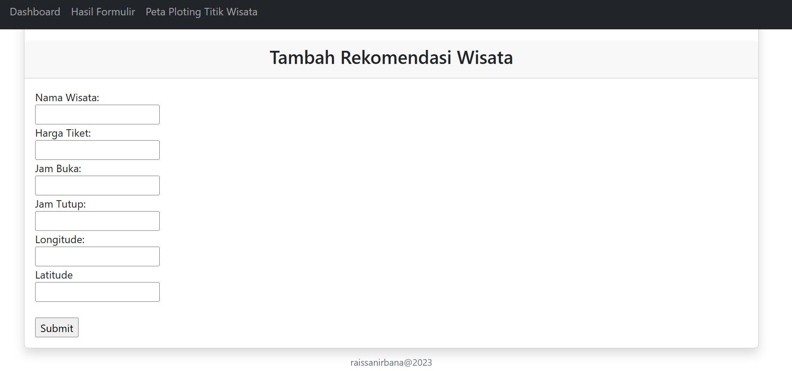

<h2>SIRPADUNG: Sistem Informasi Pariwisata Bandung Barat<h2>
<h4>Deskripsi produk</h4>

SIPARDUNG (Sistem Informasi Pariwisata Bandung Barat) ini merupakan platform WEBGIS yang menampilkan informasi terkait persebaran pariwisata Kabupaten Bandung Barat. WebGIS SIPADUNG ini dibangun untuk mempermudah wisatawan yang hendak berlibur ke Bandung, khususnya Kabupaten Bandung Barat

<h4> Komponen pembangun produk </h4>
<ol>
  <li>HTML : Digunakan untuk menyusun kerangka datar dari halaman web</li>
  <li>CSS : Digunakan untuk mengatur tampilan dan tata letak halaman web</li>
  <li>PHP : Membuat WebGIS lebih dinamis dan interaktif serta dapat berinteraksi dengan database MySQL</li>
  <li>Leaflet.js : Libray JavaScript yang digunakan untuk menampilkan peta interaktif pada halaman web</li>
  <li>Php MyAdmin: Website yang digunakan untuk menyimpan database terkait informasi wisata</li>
  <li>Geoserver : Server layanan website GIS yang digunakan untuk mengelola serta mempublikasikan terkait data geospasial </li>
  <li>Bootstrap : Framework yang digunakan untuk menghasilkan web responsif </li>
  <li>ApexCharts : Library yang digunakan untuk menampilkan data statistik dalam bentuk diagram.</li>
</ol>

<h4>Sumber Data:</h4>
<ol>
  <li>Kabupaten Bandung Barat dalam Angka 2022 dari Badan Pusat Statistik: <a href="https://bandungbaratkab.bps.go.id/publication/2022/02/25/a3256f712908489e80dcee85/kabupaten-bandung-barat-dalam-angka-2022.html">Data Statistik 2022</a></li>
  <li>Data Shapefile Administrasi Kabupaten Bandung Barat dari <a href="https://tanahair.indonesia.go.id/portal-web/">Ina Geoportal</a></li>
  <li>Data Koordinat Titik Pariwisata yang diperoleh dari Google Maps</li>
</ol>

<h4>Tangkapan Layar Komponen Penting</h4>
<ol>
  <li>Landing Page</li>
  
  
  <li>Peta Persebaran Pariwisata Kabupaten Bandung Barat</li>
  
  <li>Database</li>
  
  
</ol>
